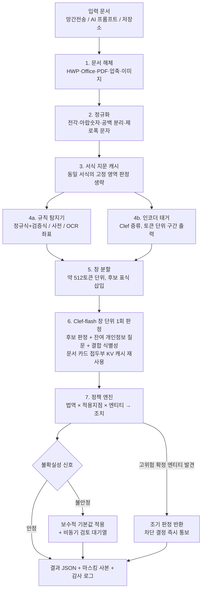

# Clef 기반 온프레미스 개인정보 판별·차단 시스템 설계 제안서

| 항목 | 내용 |
|---|---|
| 문서 상태 | 초안 v0.3 (2026-10-06) — 판별 기준을 pii-ner-x 기준으로 일원화, 공무원 성명 구분 초안 추가 (v0.2: 판정 경로에서 디코더 제거) |
| 대상 법역 | 대한민국, 일본, 미국(연방·주), 사우디아라비아 |
| 적용 지점 | ① 망간 자료전송(N2SF 등급 간 이동) ② 생성형 AI 입력 통제 ③ 저장소 일괄 점검 |
| 처리 형식 | HWP/HWPX, DOCX/XLSX/PPTX, PDF(텍스트·스캔), 이미지(신분증·사진), 압축 파일 |
| 하드웨어 기준 | 고객사 서버 1대 + 24GB급 GPU 1장(RTX 4090 / L4 / A10 계열) |
| 판정 모델 | Cloudflare Clef-flash (9B, Apache 2.0, 오픈 가중치) |
| 도식 | [PII_DETECTION_DIAGRAMS.html](PII_DETECTION_DIAGRAMS.html) — 전체 흐름, 요청 구조, 불확실 건 처리, 학습 환류, GPU 배분 |

> **자료 출처 관련 안내**: 이 문서를 작성한 환경에서는 Cloudflare 블로그 원문과 Hugging Face 모델 카드에 직접 접속할 수 없었습니다. Clef 관련 수치와 API 특성은 공개 보도·검색 요약을 근거로 정리했으며, 구현 착수 전에 공식 모델 카드와 API 명세로 다시 확인해야 합니다. 확인이 필요한 항목에는 `[확인 필요]`를 표시했습니다.

> **판별 기준 관련 안내**: 개인정보 판별 기준(엔티티 종류, 라벨 체계, 탐지 규칙, 이름·주소 판별 포함)은 **pii-ner-x 프로젝트의 기준을 따릅니다.** 이 문서의 5장 엔티티 코드, 4.1절 탐지 신호, 6장 엔티티 그룹, 7장 출력 형식은 pii-ner-x 기준을 확인하기 전에 각국 법령을 근거로 작성한 임시 내용이며, pii-ner-x 기준과 다르면 pii-ner-x 기준으로 교체합니다. pii-ner-x 기준 확인 전에 작성한 판단 규칙에는 `[pii-ner-x 기준 확인 전 초안]`을 표시했습니다. 검토 안내는 [HANDOFF_PII_NER_X.md](HANDOFF_PII_NER_X.md)를 참고하십시오.

---

## 1. 요약

이 제품은 문서를 입력받아 다음 세 가지를 결과로 제공합니다.

1. **개인정보 존재 여부**: 문서에 개인정보가 있는지
2. **엔티티 목록과 종류**: 어느 위치에 어떤 종류의 개인정보가 있는지(예: `KR.ID.RRN` 주민등록번호, `JP.ID.MYNUMBER` 개인번호, `US.ID.SSN` 사회보장번호, `SA.ID.IQAMA` 체류허가번호)
3. **차단 판정**: 적용 지점과 법역 기준에 따라 `허용 / 마스킹 후 허용 / 보류(검토자 확인) / 차단` 중 하나와 그 근거 조항

핵심 설계 원칙은 **역할 분리**입니다.

| 역할 | 담당 구성요소 | 이유 |
|---|---|---|
| 후보 위치 찾기 (어디에 있는가) | 정규식·검증식·사전·소형 NER·OCR | Clef는 텍스트 구간을 출력하지 않으므로 위치 정보는 결정론적 탐지기가 제공 |
| 의미 판정 (진짜인가, 무엇인가, 얼마나 위험한가) | **Clef-flash** | 문맥을 고려한 분류와 보정된 확률 산출이 Clef의 고유 강점 |
| 법적 결론 (막을 것인가) | 정책 엔진(규칙 테이블) | 감사 대응을 위해 판정 근거를 조항 단위로 재현 가능해야 함 |
| 구간 경계 (정형 패턴이 없는 개인정보의 위치) | Clef 증류 인코더 태거 | Clef의 판정 결과로 학습한 소형 인코더가 토큰 단위로 구간을 직접 출력 |

Clef는 "사실 판정"만 하고, "법적 결론"은 사람이 검토 가능한 규칙으로 도출합니다. 모델이 바뀌어도 정책 근거는 그대로 유지되며, 법 개정 시 모델 재학습 없이 규칙 테이블만 수정하면 됩니다.

**두 번째 원칙: 판정 경로에 디코더(System 2)를 두지 않습니다.** 자기회귀 디코더는 출력 토큰을 하나씩 생성하므로 수백 ms~수 초가 소요되어, 실시간 지점(생성형 AI 입력 통제)과 망간전송 처리량 요구를 충족하지 못합니다. 판정 경로의 모든 모델은 **순전파 1회로 결과를 반환하는 모델**(Clef-flash, 인코더 태거)로 한정하고, 불확실 건은 디코더 대신 정책 엔진의 보수적 기본값과 비동기 검토 대기열로 처리합니다(4.9절).

---

## 2. Clef(System 1 결정 모델)의 특성과 한계

### 2.1 Clef가 하는 일

Clef는 문장을 생성하는 LLM이 아닙니다. **상태(state)** 와 **유형이 정해진 질문 목록(schema)** 을 입력받아, 각 질문의 모든 허용 답안에 대한 확률을 **한 번의 순전파(prefill)** 로 반환합니다.

| 질문 유형 | 반환값 | 이 제품에서의 사용 예 |
|---|---|---|
| `noul` (예/아니오) | 참일 확률 | "후보 C17은 실제 개인정보인가?" |
| `choice` (선택지, 최대 255개) | 선택지별 확률, 합계 1 | "C17의 종류는 주민등록번호/외국인등록번호/사업자등록번호/전화번호/기타 중 무엇인가?" |
| `score` (2~10단계 서열) | 기댓값 + 단계별 확률 | "이 레코드의 재식별 가능성은 0~4 중 어느 단계인가?" |

공개 자료 기준 특성:

- Clef(27B, Qwen3.8-27B 기반)와 Clef-flash(9B, Qwen3.5-9B 기반) 두 종류이며 Apache 2.0으로 공개
- 백본은 고정하고 rank-256 LoRA 어댑터와 "joint schema head"(질문 간 상호 참조를 수행하는 소형 트랜스포머)를 학습
- 텍스트·JSON·이미지·영상 입력 지원
- Cloudflare 측정 중앙값 지연시간: Clef 209.3ms, Clef-flash 38.8ms (H200 기준) `[확인 필요: 24GB급 GPU에서는 별도 측정 필요]`
- 보정(calibration)을 목표로 한 강화학습 단계(RLCD) 적용 — 확률값을 위험도 점수로 직접 사용할 수 있다는 근거

### 2.2 System 1의 한계와 이 제품에 미치는 영향

| # | 한계 | 개인정보 판별에서 발생하는 문제 | 보완 방안(4장 참조) |
|---|---|---|---|
| L1 | 텍스트 구간(span) 추출 불가 | "어디에" 있는지 위치를 반환할 수 없음 | 후보 생성 후 판정, 토큰 지정형 선택 질문 |
| L2 | 입력 길이 제한(상태+질문 64k, 상태+최장 질문 32k 토큰) | 수백 쪽 문서를 한 번에 입력 불가 | 후보 중심 문맥 창, 문서 요약 카드 |
| L3 | 문맥 열화(context rot): 무관한 내용이 많으면 정확도 하락 | 긴 문서에서 판정 품질 저하 | 문맥 창 최소화, 질문 분할 |
| L4 | `choice` 선택지 최대 255개 | 4개국 엔티티 종류 전체를 한 질문에 나열 불가 | 계층형 분류 체계(대분류 → 세부 유형) |
| L5 | 다단계 추론·계획 불가 | 여러 항목의 결합으로 인한 식별성, 법역 간 충돌 판단이 약함 | 레코드 단위 질문 + 정책 엔진 위임 |
| L6 | 한국어·일본어·아랍어 성능 공개 수치 없음 | 비영어권 문서 정확도 미검증 | 현지 검증셋 구축, 자체 LoRA·보정 |
| L7 | 24GB GPU에서는 Clef-27B 사용 불가(bf16 기준 약 54GB), 디코더 기반 System 2는 판정 속도 요구 미충족 | 고난도 사례를 상위 모델로 넘기는 구성 불가 | 디코더 없는 계단식 구조 + 추가 호출 없는 불확실성 측정 + 보수적 기본값 + 비동기 검토 대기열 |
| L8 | 학습 데이터 비공개 | 특정 형식에 대한 편향 가능성 파악 곤란 | 형식별 회귀 테스트, 현장 데이터 재보정 |

---

## 3. 전체 아키텍처

판정 경로는 **비용이 낮은 단계부터 순서대로 실행하는 계단식 구조**이며, 모든 단계는 순전파 1회로 결과를 반환합니다.



디코더는 판정 경로 어디에도 없습니다. 저장소 점검의 야간 배치에서도 디코더를 판정에 사용하지 않으며, 선택적으로 **학습 데이터 생성용**으로만 사용할 수 있습니다(4.12절).

### 3.1 24GB GPU 자원 배분

| 구성요소 | 실행 위치 | 비고 |
|---|---|---|
| Clef-flash (8비트 양자화) | GPU 약 10~12GB | bf16 원본은 가중치만 약 18GB로 KV 캐시·이미지 토큰 여유가 부족함 `[확인 필요]` |
| 문서 카드 접두부 KV 캐시 + 묶음 처리 | GPU 약 6~8GB | 같은 문서의 창들이 문서 카드 부분의 연산 결과를 공유 |
| 인코더 태거 (다국어 인코더 약 3억 파라미터) | GPU 약 1GB (CPU 실행도 가능) | 512토큰 기준 수 ms 수준 `[확인 필요: 실측]` |
| OCR (PaddleOCR 등) | CPU 기본, 대량 점검 시 GPU 시간 분할 | 한·일·아랍 문자 지원 모델 선택 |
| 정규식·검증식·정책 엔진·서식 지문 캐시 | CPU | 결정론적, 밀리초 단위 |

양자화는 확률 보정 품질을 떨어뜨릴 수 있으므로, 양자화 후 **온도 보정(temperature scaling)** 을 현장 검증셋으로 다시 수행합니다(6.3절).

---

## 4. System 1 한계 보완 방안

### 4.1 후보 생성 → Clef 판정 (L1 대응)

Clef는 위치를 출력하지 못하므로, 위치는 결정론적 탐지기가 확보하고 Clef는 각 후보의 의미만 판정합니다. 탐지기는 **재현율 우선**으로 설정하여 의심 구간을 넓게 수집하고, 정밀도는 Clef가 확보합니다.

**사례**: 다음 문장에서 정규식은 13자리 숫자 두 개를 모두 후보로 수집합니다.

> "신청인 홍길동(900101-1234567)의 사업장 법인등록번호 110111-1234567 …"

| 후보 | 정규식 결과 | Clef 판정 |
|---|---|---|
| `900101-1234567` | 주민등록번호 형식 | 실제 개인정보 0.97, 종류 `KR.ID.RRN` |
| `110111-1234567` | 주민등록번호 형식(동일 패턴) | 실제 개인정보 0.04, 종류 `KR.ORG.CORP_REG`(법인등록번호, 개인정보 아님) |

두 번호는 형식이 같아 정규식으로는 구분할 수 없지만, "법인등록번호"라는 주변 문맥을 Clef가 판정에 반영합니다.

**후보 표식 삽입**: 상태(state)에 후보를 고유 표식으로 감싸서 전달하고, 질문 이름에 같은 ID를 사용합니다.

```json
{
  "state": {
    "doc_card": {"doc_type": "민원 신청서", "lang": "ko", "zone": "S→O 망간전송"},
    "window": "신청인 홍길동(⟦C17⟧900101-1234567⟦/C17⟧)의 사업장 법인등록번호 ⟦C18⟧110111-1234567⟦/C18⟧ …"
  },
  "questions": {
    "C17_is_real_pii": {"type": "noul"},
    "C17_category":    {"type": "choice", "options": ["고유식별", "연락처", "금융", "민감", "일반식별", "개인정보 아님"]},
    "C17_value_kind":  {"type": "choice", "options": ["실제값", "예시·샘플값", "이미 마스킹됨", "서식 자리표시자"]},
    "C18_is_real_pii": {"type": "noul"},
    "C18_category":    {"type": "choice", "options": ["고유식별", "연락처", "금융", "민감", "일반식별", "개인정보 아님"]}
  }
}
```

> 위 JSON은 구조를 설명하기 위한 예시입니다. 실제 필드명은 System One 호환 API 명세에 맞추어야 합니다 `[확인 필요]`.

joint schema head가 질문 간 상호 참조를 수행하므로, 같은 창에 있는 후보를 **한 요청에 묶으면** C17(이름 옆 번호)과 C18(법인 번호)의 차이가 서로의 판정 근거로 사용됩니다. 묶음 처리로 호출 횟수도 감소합니다.

### 4.2 계층형 분류 체계 (L4 대응)

4개국 엔티티를 합치면 100종 이상이므로 한 질문에 모두 나열하면 255개 제한에 근접하고 선택지 간 혼동도 증가합니다. 따라서 **대분류 → 세부 유형** 2단계로 질문합니다.

1. 대분류 질문(약 10개 선택지): 고유식별 / 연락처 / 금융 / 민감 / 일반식별 / 위치 / 계정·인증 / 생체 / 기관정보 / 해당 없음
2. 세부 유형 질문: 대분류와 **후보 생성기가 추정한 법역**에 맞추어 선택지를 동적으로 구성(보통 5~20개)

**사례**: 후보 `AB1234567`에 대해 생성기가 "여권번호 형식, 일본어 문맥"이라는 신호를 주면 세부 질문의 선택지는 `JP.ID.PASSPORT / JP.ID.RESIDENCE_CARD / JP.ID.DRIVER_LICENSE / GEN.OTHER_ID / 개인정보 아님` 으로 한정됩니다. 일본 체류카드 번호(영문 2자리+숫자 8자리+영문 2자리)와의 혼동을 줄이고 문맥 열화도 방지합니다.

두 질문은 한 요청에 함께 넣어 단일 순전파로 처리합니다. 결과가 서로 모순되면(대분류 "금융"인데 세부 "여권") 정책 엔진이 불일치로 기록하고 보류 판정합니다.

### 4.3 후보 중심 문맥 창과 문서 요약 카드 (L2·L3 대응)

문서 전체를 입력하지 않고, 문서를 **약 512토큰 단위 창**으로 나누어 각 창과 **문서 요약 카드**만 입력합니다. 후보 주변만 잘라내는 방식은 후보가 없는 영역을 판정하지 못하므로, 창으로 문서 전체를 빠짐없이 덮고 후보는 창 안에 표식으로 표시합니다(4.4절).

- **문서 요약 카드**: 문서 첫 1~2쪽, 제목, 표 머리글, 파일 메타데이터를 대상으로 Clef에 한 번만 질문하여 생성
  - 문서 유형(`choice`): 인사기록 / 진료기록 / 계약서 / 민원서류 / 기술문서 / 회의록 / 공문 / 통계표 …
  - 주요 언어와 데이터 주체 국적 신호(`choice`, 복수 질문)
  - 데이터 주체 규모(`score`): 0명 / 1명 / 2~10명 / 11~1,000명 / 1,000명 초과
- 카드는 이후 모든 후보 판정 요청의 상태에 포함되어, 짧은 창으로도 문서 전체 맥락을 반영합니다.

**사례**: 300쪽 기술 매뉴얼의 부록에 있는 "담당자 김철수 010-1234-5678" 한 줄은 전체 문서를 넣으면 문맥 열화로 놓칠 수 있지만, 창 단위로 입력하면 문맥이 짧아 정확도가 유지됩니다. 동시에 문서 카드의 "기술문서" 정보로 "고객 대량 명단은 아님"을 판단하여 과도한 차단을 피합니다.

### 4.4 잔여 개인정보 질문을 같은 호출에 포함 (재현율 안전망, 추가 호출 없음)

후보 생성기가 놓친 개인정보(정형 패턴이 없는 서술형 민감정보 등)를 찾기 위해, 별도 재검사 단계를 두지 않고 **후보 판정 요청에 질문 하나를 추가**합니다. Clef는 질문을 추가해도 질문 토큰만큼만 연산이 증가하므로, 별도 호출보다 비용이 훨씬 적습니다.

1. 문서를 약 512토큰 단위 창으로 분할합니다(겹침 약 64토큰).
2. 각 창에 대해 하나의 요청을 구성합니다: 창 안의 모든 후보에 대한 판정 질문 + `R_residual` 질문 "표식이 없는 부분에 개인정보가 있는가?"(`noul`) + `R_kind` 질문 "있다면 어느 대분류인가?"(`choice`)
3. `R_residual` 확률이 높은 창은 **인코더 태거의 낮은 임계값 결과**(4.5절)를 후보로 추가하여 그 창만 한 번 더 판정합니다.

**사례**: "해당 직원은 지난달 우울증으로 3주간 병가를 사용했다."에는 정형 패턴이 없어 정규식이 아무것도 수집하지 않습니다. 같은 창의 `R_residual`이 0.86, `R_kind`가 "민감"으로 나오면, 인코더 태거가 낮은 확률(0.4)로 표시했던 `우울증으로 3주간 병가` 구간을 후보로 추가하여 재판정하고 `GEN.SENS.HEALTH`(건강정보, 한국 개인정보 보호법 제23조 민감정보)로 확정합니다.

v0.1의 "확정 엔티티 치환 후 문단별 재검사"는 문단 수만큼 호출이 발생했지만, 이 방식은 **창 수만큼만** 호출하고 재판정은 의심 창에 한정됩니다.

### 4.5 Clef 증류 인코더 태거 (구간 추출을 순전파 1회로 처리)

Clef는 구간을 출력하지 못하지만, **토큰 분류형 인코더**는 순전파 1회로 모든 토큰에 `B-건강 / I-건강 / O` 같은 표시를 붙여 구간을 직접 출력합니다. 인코더 단독으로는 문맥 판단이 Clef보다 약하므로, **Clef를 교사 모델로 사용하여 인코더를 학습(증류)** 하고, 판정 경로에서는 인코더가 위치를, Clef가 의미를 담당합니다.

학습 절차(오프라인, 고객사 내부 또는 공급사에서 사전 수행):

1. 합성 문서와 비식별 처리한 현장 문서를 준비합니다.
2. 규칙 탐지기 결과 + Clef 판정 + 토큰 지정형 질문(어절에 번호를 붙여 시작·끝 번호를 `choice`로 묻는 방식)으로 **토큰 단위 정답 표시**를 자동 생성합니다. 이 단계는 반복 호출이 많지만 오프라인이므로 판정 속도에 영향이 없습니다.
3. 다국어 인코더(XLM-RoBERTa 계열 등, 약 3억 파라미터)를 이 정답 표시로 학습합니다.
4. 대분류(5.1절) 수준 표시만 학습하고, 세부 유형은 Clef가 판정합니다. 인코더의 분류 부담을 줄여 소형 모델로도 재현율을 확보하기 위함입니다.

| 구분 | 인코더 태거 | Clef-flash |
|---|---|---|
| 출력 | 토큰별 구간 표시(위치) | 질문별 확률(의미) |
| 크기·속도 | 약 3억 파라미터, 창당 수 ms | 9B, 창당 수십~수백 ms |
| 역할 | 서술형 개인정보 위치 후보 제공(재현율) | 후보의 실제 여부·종류·위험도 확정(정밀도) |

**사례**: 아랍어 인명 `محمد بن عبدالله آل سعود`는 `بن`(아들), `آل`(가문) 같은 연결 표현 때문에 정규식으로 경계를 정하기 어렵습니다. 인코더 태거가 5개 어절 전체를 하나의 `B-이름 I-이름 …` 구간으로 표시하고, Clef는 그 구간이 실제 인명인지(기관명·지명이 아닌지)만 판정합니다.

### 4.6 결합 식별성 판정 (L5 대응)

생년월일, 성별, 우편번호, 직급은 하나씩으로는 개인을 식별하기 어렵지만 결합하면 특정 개인을 식별할 수 있습니다. 한국 개인정보 보호법 제2조의 "다른 정보와 쉽게 결합하여 알아볼 수 있는 정보", 미국 NIST SP 800-122의 연계 가능 정보(linkable information)가 이 개념에 해당합니다.

- **서술형 문서**: 문단 단위로 `score` 질문 "이 문단의 정보로 특정 개인을 알아볼 수 있는 수준은?"(0: 불가 ~ 4: 즉시 식별)
- **표 형식(XLSX, CSV, HWP 표)**: 셀 단위 대신 **열 단위**로 판정합니다. 열 머리글 + 표본 값 20개를 상태로 입력하고 열의 엔티티 종류를 `choice`로 판정합니다. 이후 열 조합을 정책 엔진이 평가합니다.

**사례**: 10,000행 엑셀에 `부서 / 직급 / 입사연도 / 성별` 열만 있는 경우, 각 열은 개인정보가 아닌 것으로 판정됩니다. 그러나 행 판정 표본에서 "기획팀 / 부장 / 1998 / 여"처럼 조합의 고유값 비율이 높으면(k-익명성 k=1인 행 다수) 정책 엔진이 "결합 식별 위험"으로 분류하여 망간전송 시 보류합니다. 고유값 비율 계산은 CPU에서 결정론적으로 수행하고, Clef는 각 열이 준식별자인지만 판정합니다.

열 단위 판정으로 10,000행 표의 Clef 호출이 수만 회에서 열 개수(수십 회) 수준으로 감소합니다.

### 4.7 예시값·마스킹값·자리표시자 구분 (오탐 감소)

공공기관 문서에는 서식 안내문, 작성 예시, 이미 마스킹된 값이 많습니다. 형식만 보는 탐지기는 이를 모두 개인정보로 처리하여 업무를 방해합니다.

| 원문 | 형식 탐지기 | Clef `value_kind` 판정 | 조치 |
|---|---|---|---|
| `주민등록번호: ______-_______` | 해당 없음 또는 오탐 | 서식 자리표시자 | 허용 |
| `예) 800101-1******` | 주민등록번호 | 이미 마스킹됨 | 허용(일부 법역은 생년월일 노출 경고) |
| `(작성 예시) 홍길동, 900101-1234567` | 주민등록번호 | 예시·샘플값 | 저장소 점검: 경고 / 망간전송: 보류 |
| `신청인 900101-1234567` | 주민등록번호 | 실제값 | 정책 적용 |

예시값으로 판정되더라도 **실제 형식 검증을 통과한 번호**는 망간전송 지점에서 보류합니다. 예시라는 표기가 실제 개인정보를 숨기는 수단으로 사용될 수 있기 때문입니다.

### 4.8 추가 호출 없는 불확실성 측정

v0.1의 섭동 검사(같은 내용을 3~5회 변형 판정)는 호출 수를 늘리므로, 실시간 경로에서는 **이미 계산된 값만으로** 불확실성을 측정합니다.

| 신호 | 계산 방법 | 불안정 판단 예 |
|---|---|---|
| 확률 여백 | Clef `choice`의 1위와 2위 확률 차이 | 차이 < 0.2 |
| 계층 불일치 | 대분류 질문과 세부 유형 질문의 결과 모순 | 대분류 "금융", 세부 "여권" |
| 탐지기 간 불일치 | 규칙 탐지기·인코더 태거·Clef의 결론 비교 | 검증식 통과 + 인코더 미표시 + Clef 0.4 |
| 잔여 질문 충돌 | `R_residual`이 높은데 추가 후보가 없음 | 개인정보가 있다고 판정했으나 위치 불명 |

**사례**: 일본어 문서의 `090-1234-5678`은 규칙 탐지기(휴대전화 형식), 인코더(연락처), Clef(`JP.CONTACT.MOBILE` 0.96)가 모두 일치하므로 즉시 확정합니다. 아랍어 문서의 10자리 숫자가 검증식은 통과했지만 Clef에서 `SA.ID.NATIONAL` 0.48, `GEN.FIN.ACCOUNT` 0.41로 여백이 작으면 "불안정"으로 표시하고 4.9절 처리를 적용합니다.

섭동 검사는 **저장소 일괄 점검의 야간 배치에서만** 선택적으로 실행합니다. 처리량 여유가 있고, 불안정 건을 검토 대기열에 넣기 전에 한 번 더 걸러 검토 부담을 줄이는 효과가 있습니다.

### 4.9 디코더 없는 불확실 건 처리

불확실 건을 상위 모델(디코더)로 넘기지 않고, 다음 세 가지로 처리합니다.

**① 보수적 기본값**: 불확실 엔티티는 가능한 해석 중 **가장 엄격한 정책이 적용되는 해석**으로 처리합니다. 위 사례에서 `SA.ID.NATIONAL`(신분증)과 `GEN.FIN.ACCOUNT`(계좌)가 경합하면, 두 해석 모두 마스킹 대상이므로 마스킹 후 허용(AI 입력) 또는 보류(망간전송)를 적용합니다. 두 해석의 조치가 같으면 불확실성이 결론에 영향을 주지 않으므로 검토 대기열에도 넣지 않습니다.

**② 비동기 검토 대기열**: 결론이 달라지는 불확실 건만 검토자에게 전달합니다. 판정 경로는 대기하지 않으며, 망간전송만 검토 완료 시까지 전송이 보류됩니다.

**③ 템플릿 기반 근거 문장**: 근거 설명에 디코더를 사용하지 않고, 엔티티 코드·법 조항 테이블·Clef 확률을 조합한 템플릿으로 즉시 생성합니다.

```text
C17 | 주민등록번호(KR.ID.RRN) | 고유식별정보, 개인정보 보호법 제24조·제24조의2
    | 근거: 주민등록번호 형식 일치, 검증식 통과, 문맥상 실제값 확률 0.97
    | 조치: 망간전송(S→O) 차단 [규칙 R-ID-001]
```

검토자에게 필요한 정보는 "무엇이, 어느 조항 때문에, 얼마나 확실하게"이며, 이는 구조화된 값으로 충분히 표현됩니다. 서술형 설명이 필요한 경우에도 판정 이후의 별도 화면 기능으로 분리하여 판정 지연에 포함되지 않도록 합니다.

### 4.10 다중 모달 처리 (신분증 사진·스캔 문서)

| 입력 | 처리 |
|---|---|
| 스캔 PDF·사진 | OCR로 텍스트와 좌표를 추출 → 텍스트 경로와 동일하게 처리, 결과에 쪽 번호·좌표 포함 |
| 신분증 이미지 | Clef에 이미지를 직접 입력하여 `choice` 질문: 주민등록증 / 운전면허증 / 여권 / 외국인등록증 / 在留カード / マイナンバーカード / 미국 운전면허증 / 사우디 신분증 / Iqama / 신분증 아님 |
| 얼굴 사진 | `noul` "식별 가능한 얼굴이 포함되어 있는가" → 잠재 생체정보로 분류 (한국은 특정 개인 식별 목적의 처리일 때 민감정보, 미국 일리노이 BIPA 등은 얼굴 기하 정보 자체를 규제하므로 법역별로 다르게 처리) |
| 서명·도장 이미지 | `noul` 판정 후 일반식별 정보로 분류 |
| 이미지 메타데이터 | EXIF GPS 좌표, 촬영 기기 일련번호를 결정론적으로 추출하여 위치정보 엔티티로 등록 |

이미지는 토큰을 많이 소모하므로, 신분증 판정은 저해상도 축소본으로 먼저 수행하고 신분증으로 판정된 경우에만 원본 해상도 OCR을 실행합니다.

### 4.11 정규화와 우회 표현 대응

후보 생성 전에 다음 정규화를 수행합니다. 원문 위치와 정규화 위치의 대응표를 유지하여 결과에는 원문 좌표를 반환합니다.

| 우회·변형 표현 | 예 | 정규화 결과 |
|---|---|---|
| 전각 숫자(일본어 문서) | `０９０－１２３４－５６７８` | `090-1234-5678` |
| 아랍-인도 숫자(사우디 문서) | `١٠٢٣٤٥٦٧٨٩` | `1023456789` |
| 공백·구두점 삽입 | `9 0 0 1 0 1 - 1 2 3 …` | `900101-123…` |
| 한글 숫자 표기 | `공일공 일이삼사 오육칠팔` | `010 1234 5678` |
| 제로폭 문자 삽입 | `9001​01-…` | 제거 |
| 하이픈 변형 | `‐ ‑ – — ー －` | `-` |

또한 망간전송 지점에서는 **숨겨진 내용**을 반드시 검사합니다: HWP/Office의 메모·변경 추적 기록·숨김 시트·숨김 텍스트, 문서 속성(작성자·최종 수정자), 삽입 개체(OLE), 압축 파일 내부 파일(재귀 해제, 깊이·용량 제한 포함).

### 4.12 현장 적응 학습 (L6·L8 대응)

Clef는 Apache 2.0 오픈 가중치이므로 고객사 내부에서 추가 학습이 가능합니다. Cloudflare의 강화학습 미세조정 서비스는 클라우드 기반이므로 온프레미스 환경에서는 다음 방식을 사용합니다.

1. **합성 데이터 생성기**: 검증식을 통과하는 가상의 주민등록번호·마이넘버·SSN·Iqama 번호와 가상 인명·주소를 실제 공문서 서식(민원서, 인사발령, 계약서)에 삽입하여 정답 표시가 포함된 학습 문서 생성
2. **어려운 반례 포함**: 법인등록번호, 사업자등록번호, 문서번호, 제품 일련번호, 국제표준도서번호처럼 형식은 유사하지만 개인정보가 아닌 값
3. **LoRA·schema head 추가 학습**: 백본은 고정하고 어댑터만 학습하므로 24GB GPU 1장에서도 4비트 양자화 학습(QLoRA)으로 가능 `[확인 필요: schema head 학습 코드 공개 여부]`
4. **검토자 판정 환류**: 검토 대기열에서 검토자가 확정한 판정을 비식별 처리 후 Clef LoRA와 인코더 태거의 학습 데이터로 축적(월 단위 재학습)
5. **디코더의 제한적 사용(선택)**: 디코더는 판정 경로에서 제외하고, 야간에 합성 학습 문서(다양한 서식·문체의 가상 공문서)를 생성하는 용도로만 사용할 수 있습니다. 판정 속도와 무관한 오프라인 작업입니다.

### 4.13 판정 속도 최적화

디코더를 제외한 뒤에도 Clef-flash 호출이 전체 처리 시간의 대부분을 차지하므로, 호출 수와 호출당 연산량을 함께 줄입니다.

| 방법 | 내용 | 효과 |
|---|---|---|
| 창 단위 통합 질문 | 후보 판정·잔여 질문·결합 식별성 질문을 창당 1회 요청에 통합(4.4절) | 호출 수 = 창 수 |
| 접두부 KV 캐시 재사용 | 요청 구조를 `[문서 카드] + [창 본문] + [질문]` 순서로 고정하여, 같은 문서의 모든 창이 문서 카드 연산 결과를 재사용 (vLLM 자동 접두부 캐시 등) `[확인 필요: Clef 서빙 런타임 지원 여부]` | 창당 연산 토큰 감소 |
| 창 묶음 처리 | 한 문서의 모든 창을 하나의 GPU 묶음으로 동시 처리 | 문서당 지연이 창 수에 비례하지 않음 |
| 서식 지문 캐시 | 공공기관 문서는 같은 서식(민원신청서, 인사발령문)이 반복되므로, 서식의 고정 문구 영역은 지문(해시)으로 식별하여 판정을 생략하고 입력란만 판정 | 반복 서식 문서의 호출 수 감소 |
| 중복 문서 해시 | 저장소 점검·망간전송에서 이미 판정한 동일 파일은 결과 재사용 | 재전송·사본 처리 생략 |
| 조기 판정 반환 | 망간전송에서 "차단"이 확정되는 고위험 엔티티(검증식 통과 + Clef ≥ 0.9인 고유식별번호 등)가 발견되면 차단 결정을 즉시 반환하고, 전체 엔티티 목록은 이어서 완성 | 사용자 대기 시간 단축, 결과 완전성 유지 |
| 규칙 단독 확정 | 검증식 통과 + 명시적 항목명(예: "주민등록번호:") + 마스킹 아님이 모두 충족되면 Clef 판정 없이 확정 | 정형 고유식별번호의 Clef 호출 생략 |

**사례**: 직원 50명의 인사발령 공문(HWP, 3쪽) 망간전송 요청 → 서식 지문 캐시로 머리글·결재란·고정 문구를 제외 → 입력란 영역 약 4개 창 → 첫 창에서 주민등록번호가 규칙 단독 확정되어 즉시 "차단" 반환 → 나머지 창은 같은 묶음에서 처리되어 전체 엔티티 목록 완성.

---

## 5. 엔티티 분류 체계

> 이 장의 코드와 엔티티 목록은 pii-ner-x 라벨 체계로 교체할 임시 내용입니다. 이름·주소를 포함한 모든 판별 기준은 pii-ner-x 기준을 따릅니다.

### 5.1 코드 규칙

`{법역}.{대분류}.{세부유형}` 형식을 사용합니다. 여러 국가에 공통인 항목은 법역을 `GEN`으로 표기합니다.

| 대분류 코드 | 의미 |
|---|---|
| `ID` | 고유식별번호(국가 발급 번호) |
| `CONTACT` | 연락처(전화, 이메일, 주소) |
| `FIN` | 금융(계좌, 카드, 신용정보) |
| `SENS` | 민감정보(건강, 신념, 범죄경력, 노동조합 등) |
| `BIO` | 생체정보(얼굴, 지문, 홍채, 음성) |
| `NAME` | 성명 |
| `DEMO` | 인구통계·준식별자(생년월일, 성별, 나이, 국적) |
| `LOC` | 위치정보(정밀 좌표, GPS) |
| `AUTH` | 계정·인증(아이디+비밀번호, 인증 토큰) |
| `ORG` | 기관정보(개인정보 아님, 오탐 구분용) |

### 5.2 법역별 주요 엔티티

**대한민국** — 개인정보 보호법, 신용정보법, 정보통신망법

| 코드 | 엔티티 | 법적 분류 | 탐지 신호 |
|---|---|---|---|
| `KR.ID.RRN` | 주민등록번호 | 고유식별정보(시행령 제19조), 처리 제한(법 제24조의2) | `YYMMDD-[1-8]XXXXXX`, 검증식 |
| `KR.ID.FRN` | 외국인등록번호 | 고유식별정보 | 뒷자리 첫 숫자 5~8 |
| `KR.ID.PASSPORT` | 여권번호 | 고유식별정보 | `M`+8자리(구형), `M123A4567`(신형) |
| `KR.ID.DRIVER` | 운전면허번호 | 고유식별정보 | 지역코드 2자리+10자리 |
| `KR.FIN.ACCOUNT` | 계좌번호 | 개인신용정보 | 은행별 자릿수, 은행명 문맥 |
| `KR.ID.HEALTH_INS` | 건강보험증 번호 | 일반 개인정보(건강 문맥 시 민감) | 11자리 |
| `KR.CONTACT.MOBILE` | 휴대전화번호 | 일반 개인정보 | `01[016789]` |
| `KR.SENS.*` | 사상·신념, 노동조합·정당, 정치적 견해, 건강, 성생활, 유전정보, 범죄경력, 생체인식정보, 인종·민족 | 민감정보(법 제23조, 시행령 제18조) | 서술형 → Clef 판정 |

주의: 2020년 10월 이후 발급된 주민등록번호는 뒷자리에 지역번호와 검증 숫자가 없는 임의번호 체계이므로 **검증식 불일치를 개인정보가 아니라는 근거로 사용하면 안 됩니다.** 검증식 통과 여부는 Clef 입력의 보조 신호로만 사용합니다.

**일본** — 個人情報の保護に関する法律(개인정보보호법), 番号法(마이넘버법)

| 코드 | 엔티티 | 법적 분류 | 탐지 신호 |
|---|---|---|---|
| `JP.ID.MYNUMBER` | 個人番号(마이넘버) | 特定個人情報, 번호법상 수집·보관 자체가 제한됨 | 12자리, 검사 숫자 |
| `JP.ORG.CORPNUM` | 法人番号 | 개인정보 아님(오탐 구분) | 13자리 |
| `JP.ID.PASSPORT` | 旅券番号 | 個人識別符号 | 영문 2자리+숫자 7자리 |
| `JP.ID.DRIVER` | 運転免許証番号 | 個人識別符号 | 12자리 |
| `JP.ID.PENSION` | 基礎年金番号 | 個人識別符号 | 4자리-6자리 |
| `JP.ID.RESIDENCE_CARD` | 在留カード番号 | 個人識別符号 | 영문 2+숫자 8+영문 2 |
| `JP.ID.HEALTH_INS` | 保険者番号·被保険者記号番号 | 個人識別符号 | 서식 문맥 |
| `JP.CONTACT.MOBILE` | 휴대전화 | 個人情報 | `0[789]0` |
| `JP.SENS.*` | 人種, 信条, 社会的身分, 病歴, 犯罪の経歴, 犯罪被害事実, 障害, 健康診断結果 등 | 要配慮個人情報(취득 시 동의 필요, 옵트아웃 제3자 제공 불가) | 서술형 → Clef 판정 |

**미국** — 단일 연방법이 없으므로 분야별 연방법과 주법을 함께 적용합니다.

| 코드 | 엔티티 | 근거 | 탐지 신호 |
|---|---|---|---|
| `US.ID.SSN` | Social Security Number | 주 유출통지법, CCPA 민감정보, HIPAA | `AAA-GG-SSSS`, 000·666·9xx 영역 제외 |
| `US.ID.ITIN` | 납세자번호(ITIN) | 주 유출통지법 | 9로 시작 |
| `US.ID.DRIVER` | 운전면허·주 신분증 번호 | CCPA 민감정보, 주 유출통지법 | 주별 형식 + 주 이름 문맥 |
| `US.ID.PASSPORT` | 여권번호 | CCPA 민감정보 | 9자리 |
| `US.ID.MBI` | Medicare 수혜자 번호 | HIPAA PHI | 11자리 영숫자 규칙 |
| `US.ID.MRN` | 의료기록번호 | HIPAA 18개 식별자 | 문맥 의존 |
| `US.AUTH.CREDENTIAL` | 계정 + 비밀번호 | CCPA 민감정보 | 근접 출현 |
| `US.LOC.PRECISE` | 정밀 위치(반경 1,850피트 이내) | CCPA 민감정보 | 좌표 소수점 자리수 |
| `US.BIO.*` | 생체 식별자 | 일리노이 BIPA, CCPA | 이미지·서술 |
| `US.SENS.*` | 인종·종교·노조·성적 지향·건강·유전·이민 신분 | CCPA 민감정보, HIPAA | 서술형 → Clef 판정 |

추가로 미국 법무부의 대량 민감 개인정보 이전 제한 규정(28 CFR Part 202)은 **건수 기준**을 사용합니다(예: 정밀 위치 1,000개 기기, 건강·금융정보 10,000명, 식별자 100,000명 등). 문서 요약 카드의 "데이터 주체 규모" 판정과 표의 행 수를 정책 엔진 입력으로 사용합니다. `[확인 필요: 법무팀의 최신 기준 검토]`

**사우디아라비아** — Personal Data Protection Law(PDPL, 2023년 9월 시행, 감독기관 SDAIA), NDMO 데이터 분류 기준

| 코드 | 엔티티 | 법적 분류 | 탐지 신호 |
|---|---|---|---|
| `SA.ID.NATIONAL` | 국민 신분증 번호 | 개인정보 | 10자리, `1`로 시작, 검증식 |
| `SA.ID.IQAMA` | 체류허가(Iqama) 번호 | 개인정보 | 10자리, `2`로 시작, 검증식 |
| `SA.FIN.IBAN` | IBAN | 금융·신용정보 | `SA`+22자리 |
| `SA.CONTACT.MOBILE` | 휴대전화 | 개인정보 | `+966 5x` / `05x` |
| `SA.DEMO.HIJRI_DOB` | 이슬람력 생년월일 | 준식별자 | `هـ` 표기, 이슬람력 날짜 |
| `SA.SENS.*` | 인종·민족, 종교·사상·정치 신념, 보안·범죄 정보, 생체·유전, 건강, 신용, **부모 미상 여부** | 민감 개인정보 | 아랍어 서술형 → Clef 판정 |

아랍어 인명은 `بن`(아들), `آل`(가문) 등의 연결 표현이 포함되어 구간 경계 판단이 어려우므로, 4.5절 인코더 태거 학습 데이터에 아랍어 인명 사례를 별도 비중으로 포함합니다.

---

### 5.3 이름·주소 판별

이름(성명)과 주소의 판별 기준은 **pii-ner-x 프로젝트의 기준을 따릅니다.** 다음 항목을 pii-ner-x 기준으로 확정합니다.

- 이름·주소 라벨 이름과 세부 유형(예: 한자·가나 표기 인명, 도로명·지번 주소, 우편번호)
- 후보 탐지 규칙(사전, 호칭·직함 신호, 서식 항목명, 주소 구조 규칙)
- 오탐 처리 기준(성씨와 같은 일반어, 기관명·지명 속 인명, 가상 인물, 기관·사업장 주소)
- 주소 상세도에 따른 개인정보 해당 여부(예: 시·군·구 단위 허용 여부)

이 설계에서 이름·주소 판별에 관여하는 구성요소(규칙 탐지기, 인코더 태거, Clef 질문 선택지, 정책 엔진 엔티티 그룹)는 위 기준을 입력으로 받아 동작하며, 판별 기준 자체를 별도로 정의하지 않습니다.

### 5.4 직무 수행 공무원 성명 구분 `[pii-ner-x 기준 확인 전 초안]`

> 이 절은 pii-ner-x 기준을 확인하기 전에 작성한 초안입니다. pii-ner-x에 공무원 성명 처리 기준이 있으면 그 기준을 따르고, 없으면 이 초안을 pii-ner-x 쪽 검토를 거쳐 확정합니다.

**법적 배경**: 정보공개법 제9조 제1항 제6호는 개인 식별 정보를 비공개 대상으로 정하되, 라목에서 "직무를 수행한 공무원의 성명·직위"를 예외로 둡니다. 다만 공무원 성명도 개인정보 보호법상 개인정보이며, 최근에는 악성 민원 대응을 이유로 담당자 성명을 공개하지 않는 기관이 늘고 있습니다. 따라서 공무원 성명 예외는 **기관별 설정**으로 두고, 기본값은 "일반 성명과 동일하게 처리"로 합니다.

**구분 기준**: 판단 대상은 "그 사람이 공무원인가"가 아니라 "이 문서에서 직무를 수행한 사람으로 등장하는가"입니다.

| 신호 | 방법 | 예 |
|---|---|---|
| 문서 내 위치 | 결재란, 기안자·검토자, "담당:" 표기 | `기안 주무관 이영희 → 검토 과장 박철수` |
| 직급 표기 | 주무관·사무관·서기관·과장 등 직급이 성명 앞뒤에 표기됨 | `행정과 주무관 이영희` |
| 직원 명부 대조 | 기관 인사 시스템의 직원 성명 목록과 해시 값으로 비교(원문 비저장) | 명부 일치 → 공무원 후보 |
| Clef 역할 판정 | 성명 후보마다 `choice` 질문: 직무 수행 공무원 / 민원인·일반인 / 사적 정보의 주체인 직원 / 가상 인물 / 기관·지명 | `C21_role` |

**판정 규칙(초안)**: 다음 세 조건을 모두 충족할 때만 "직무 수행 공무원 성명"으로 분류하고, 그 외에는 일반 성명으로 처리합니다. 불확실하면 보호하는 쪽으로 처리합니다.

1. 직무 수행 문맥(결재란, 담당자 표기, 직급 표기)이 있음
2. Clef 역할 판정에서 "직무 수행 공무원" 확률이 기준 이상
3. 같은 창에 해당 인물과 연결된 민감정보가 없음

**명부 대조만으로 판정하면 안 되는 경우**

| 경우 | 예 | 처리 |
|---|---|---|
| 직원이 사적 정보의 주체 | "주무관 이영희는 우울증으로 병가…"(징계·병가·인사평가 문서) | 명부에 있어도 일반 성명, 민감정보 결합으로 처리 |
| 동명이인 | 민원인 "김민수"와 직원 "김민수" | 직무 수행 문맥이 없으면 일반 성명 |
| 다른 기관 공무원 | 협조 공문의 타 기관 담당자 | 명부 대조 불가, 직급·결재란 문맥으로만 판정 |

**사례**: "민원인 김민수(서울 마포구 월드컵북로 400, 3층) … 담당: 행정과 주무관 이영희"에서 `김민수`는 일반 성명이며 주소와 결합되어 있고, `이영희`는 기관 설정이 "공무원 성명 예외 적용"일 때만 직무 수행 공무원 성명으로 분류되어 마스킹에서 제외됩니다. 주소(`월드컵북로 400, 3층`)의 판별은 5.3절에 따라 pii-ner-x 기준을 따릅니다.

---

## 6. 차단 판정 정책

### 6.1 정책 엔진 입력과 출력

정책 엔진은 다음 네 가지를 입력으로 받아 조치를 결정하는 **결정론적 규칙 테이블**입니다.

1. 엔티티 목록(코드, Clef 확률, 값 종류)
2. 법역 집합(문서 요약 카드와 엔티티 코드에서 도출)
3. 적용 지점(망간전송 / 생성형 AI / 저장소)
4. 규모(데이터 주체 수, 행 수)

**법역이 여러 개인 경우 가장 엄격한 규칙을 적용합니다.** 예: 한국 기관 문서에 일본인 직원의 마이넘버가 포함되면 한국 규칙과 일본 번호법 규칙 중 엄격한 쪽(차단)을 적용합니다.

### 6.2 적용 지점별 기본 정책 (예시)

| 엔티티 그룹 | 망간전송 (S→O 등) | 생성형 AI 입력 | 저장소 점검 |
|---|---|---|---|
| 고유식별번호 (RRN, 마이넘버, SSN, Iqama 등) | 차단 | 차단 또는 자동 마스킹 후 허용 | 위반 등록 + 암호화 여부 확인 |
| 민감정보 (건강, 범죄경력, 신념 등) | 차단 | 차단 | 위반 등록 + 접근권한 점검 |
| 금융 (계좌, 카드, IBAN) | 차단 | 마스킹 후 허용 | 위반 등록 |
| 연락처·성명 (소량) | 마스킹 후 허용 | 마스킹 후 허용 | 기록 |
| 연락처·성명 (대량, 예: 100명 초과) | 차단 | 차단 | 위반 등록 |
| 결합 식별 위험 (준식별자 조합) | 보류 | 마스킹 후 허용 | 기록 |
| 예시·샘플값 (형식 검증 통과) | 보류 | 허용 | 경고 |
| 판정 불안정 (4.8절) | 보류 | 차단(보수적 기본값) | 검토 대기열 |
| 직무 수행 공무원 성명 (5.4절, 초안) | 기관 설정에 따름(기본값: 일반 성명과 동일) | 기관 설정에 따름(기본값: 마스킹) | 기록 |

N2SF 연계: 개인정보가 포함된 문서는 기관 분류 기준에 따라 S(민감) 등급 이상으로 표시하고, 하위 등급 영역으로의 이동 시 위 망간전송 규칙을 적용합니다. 등급 판정 기준은 기관별 N2SF 등급 분류 결과를 따릅니다.

### 6.3 확률과 임계값

- Clef 확률을 그대로 사용하지 않고, 현장 검증셋으로 **온도 보정**을 수행한 값을 사용합니다(양자화 영향 보정 포함).
- 엔티티 그룹별로 임계값을 따로 설정합니다. 고유식별번호는 놓쳤을 때 손실이 크므로 낮은 임계값(예: 0.3)으로 재현율을 우선하고, 성명은 오탐 부담이 크므로 높은 임계값(예: 0.7)을 사용합니다.
- 확률이 임계값 근처(±0.15)인 판정은 4.8절 불확실성 신호와 함께 평가하고, 결론이 달라지는 경우에만 4.9절 검토 대기열로 보냅니다.

---

## 7. 결과 형식

```json
{
  "document_id": "sha256:4f1c…",
  "has_personal_data": true,
  "jurisdictions": ["KR", "JP"],
  "doc_card": {
    "doc_type": {"value": "인사기록", "p": 0.91},
    "data_subject_scale": {"value": "2~10명", "p": 0.77}
  },
  "entities": [
    {
      "id": "C17",
      "code": "KR.ID.RRN",
      "label": "주민등록번호",
      "category": "고유식별정보",
      "legal_basis": ["KR-PIPA §24", "KR-PIPA §24-2"],
      "location": {"page": 2, "char_start": 1043, "char_end": 1057, "bbox": null, "source": "body"},
      "masked_preview": "900101-1******",
      "value_kind": "실제값",
      "confidence": 0.97,
      "evidence": {
        "detectors": ["regex:kr_rrn", "checksum:pass"],
        "clef": {"is_real_pii": 0.97, "category": {"고유식별": 0.95, "개인정보 아님": 0.03}},
        "stability": "stable"
      }
    },
    {
      "id": "C31",
      "code": "JP.ID.MYNUMBER",
      "label": "個人番号(마이넘버)",
      "category": "特定個人情報",
      "legal_basis": ["JP-番号法 §20"],
      "location": {"page": 5, "bbox": [112, 540, 298, 562], "source": "ocr:image_3"},
      "masked_preview": "1234 **** ****",
      "value_kind": "실제값",
      "confidence": 0.88
    },
    {
      "id": "P07",
      "code": "GEN.SENS.HEALTH",
      "label": "건강정보",
      "category": "민감정보",
      "legal_basis": ["KR-PIPA §23"],
      "location": {"page": 3, "char_start": 2210, "char_end": 2219, "source": "body"},
      "value_kind": "실제값",
      "confidence": 0.81,
      "evidence": {"detectors": ["encoder_tagger:B-SENS", "clef:R_residual=0.86"]}
    }
  ],
  "decision": {
    "action": "BLOCK",
    "checkpoint": "망간전송(S→O)",
    "reasons": [
      {"rule": "R-ID-001", "text": "고유식별번호 포함 문서의 하위 등급 전송 금지", "entities": ["C17", "C31"]},
      {"rule": "R-SENS-002", "text": "민감정보(건강) 포함", "entities": ["P07"]}
    ],
    "alternatives": ["마스킹 사본 생성 후 재전송 신청"]
  },
  "audit": {"model": "clef-flash-q8", "calibration": "2026-10-r1", "policy_version": "2026.10.1", "elapsed_ms": 1840}
}
```

- 개인정보 원문 값은 결과와 로그에 저장하지 않고 **마스킹 미리보기**만 기록합니다(탐지 시스템 자체가 개인정보 유출 경로가 되는 것을 방지).
- `evidence`는 감사·이의 신청 대응용이며, 어떤 탐지기와 어떤 확률로 판정했는지 재현할 수 있습니다.

---

## 8. 적용 지점별 처리 흐름

| 항목 | 망간 자료전송 | 생성형 AI 입력 통제 | 저장소 일괄 점검 |
|---|---|---|---|
| 지연 목표 | 문서당 수 초 ~ 수십 초 허용 | 프롬프트당 1초 이내 | 처리량 우선(야간 배치) |
| 적용 단계 | 전 단계 + 숨겨진 내용 검사 + 조기 판정 반환 | 정규화 → 규칙·인코더 → Clef 창 단위 1회(프롬프트는 대부분 창 1~2개) | 전 단계 + 야간 섭동 검사(선택) |
| 불확실 시 | 보류(검토자 승인) | 보수적 기본값(마스킹 또는 차단) | 검토 대기열 |
| 추가 기능 | 마스킹 사본 자동 생성 | 마스킹 후 원래 값 복원(응답에 자리표시자 역치환) | 중복 문서 해시 캐시, 변경분만 재점검 |

**생성형 AI 입력 통제 사례**: 사용자가 "홍길동(010-1234-5678) 고객의 민원 답변 초안을 작성해 줘"를 입력하면, 외부 LLM에는 "[이름_1]([전화번호_1]) 고객의 민원 답변 초안을 작성해 줘"가 전송됩니다. 응답의 `[이름_1]`은 사용자 화면에서만 원래 값으로 복원됩니다. 대응표는 메모리에만 보관하고 세션 종료 시 삭제합니다.

---

## 9. 성능 추정과 검증 계획

### 9.1 처리량 추정 방법

정확한 수치는 24GB GPU 실측이 필요합니다. 다음 식으로 사전 추정합니다.

```
문서당 Clef 호출 수 ≈ 1 (문서 카드)
                    + 창 수 (서식 지문으로 제외한 영역 제외)
                    + 잔여 의심 창 수 (재판정)
문서당 지연 ≈ 문서 카드 1회 + ⌈창 수 / 묶음 크기⌉ × 묶음 1회 지연
```

**사례**: 10쪽 인사 문서(약 5,000토큰) → 창 약 10개 + 문서 카드 1회 + 잔여 의심 창 2개 = 13회 호출. 창 10개를 한 묶음으로 처리하면 순차 처리 단위는 문서 카드 → 창 묶음 → 의심 창 묶음의 3단계입니다. v0.1 추정(82회 호출, 디코더 System 2 별도)과 비교하면 호출 수가 약 1/6로 감소하고 디코더 생성 시간이 제거됩니다. 묶음 1회 지연은 24GB GPU 실측 후 확정합니다.

### 9.2 검증셋과 지표

| 검증셋 | 구성 | 주요 지표 |
|---|---|---|
| 형식 엔티티 | 4개국 식별번호 실제 서식 문서(합성값) | 유형별 재현율 ≥ 99%, 정밀도 ≥ 95% |
| 서술형 민감정보 | 인사·의료·징계 문서(합성) | 재현율 ≥ 90% |
| 오탐 반례 | 법인번호, 문서번호, 제품 일련번호, 서식 안내문 | 오탐률 ≤ 3% |
| 다국어 | 한·일·아랍·영 혼합 문서, 전각·아랍 숫자 | 언어별 재현율 편차 ≤ 5%p |
| 스캔·이미지 | 신분증 합성 이미지, 저화질 스캔 | 신분증 종류 정확도 ≥ 95% |
| 보정 | 전 검증셋 | 기대 보정 오차(ECE) ≤ 0.05 |

목표 수치는 초기 기준값이며, 1차 실측 후 조정합니다.

---

## 10. 단계별 개발 계획

| 단계 | 기간(안) | 내용 | 산출물 |
|---|---|---|---|
| 0. 사전 검증 | 2주 | Clef-flash 양자화 적재, 24GB GPU 지연시간·메모리·묶음 크기별 처리량 실측, 접두부 캐시 적용 가능 여부, 한·일·아랍어 기본 판정 품질 확인, API 명세 확인 | 실측 보고서, 진행 여부 결정 |
| 1. 핵심 파이프라인 | 6주 | 문서 해체(HWP 포함), 정규화, 후보 생성기, Clef 창 단위 판정, 접두부 캐시·묶음 처리, 정책 엔진, 결과 JSON | 저장소 점검용 배치 버전 |
| 2. 보완 기능 | 6주 | 인코더 태거 증류 학습, 잔여 질문, 결합 식별성, 불확실성 신호·보수적 기본값, 서식 지문 캐시, 조기 판정 반환, OCR·신분증 판정 | 망간전송 연동 버전 |
| 3. 실시간 경로 | 4주 | 생성형 AI 프록시, 마스킹·복원, 지연 최적화 | AI 입력 통제 버전 |
| 4. 현장 적응 | 상시 | 합성 데이터 LoRA 학습, 보정, 검토자 환류 | 월간 모델·정책 갱신 |

### 10.1 주요 위험과 대응

| 위험 | 영향 | 대응 |
|---|---|---|
| Clef-flash의 한국어·아랍어 성능 부족 | 서술형 민감정보 재현율 미달 | 0단계에서 확인 후, 미달 시 LoRA 추가 학습 비중 확대 |
| 24GB GPU 메모리 부족(이미지 입력 시) | 처리 중단 | 이미지 축소본 우선 판정, 이미지 판정 별도 대기열 |
| 양자화로 인한 보정 품질 저하 | 임계값 기반 판정 오류 | 양자화 모델 기준 재보정 |
| 법 개정(일본 개인정보보호법 3년 주기 재검토 등) | 정책 불일치 | 정책 테이블 버전 관리, 법무 검토 주기 수립 |
| 탐지 시스템 자체의 개인정보 보관 | 2차 유출 | 원문 값 비저장, 마스킹 미리보기만 기록, 감사 로그 암호화 |
| 인코더 태거의 서술형 개인정보 재현율 부족 | 민감정보 누락 | Clef 잔여 질문(4.4절)이 창 단위로 누락을 감지하여 재판정, 누락 사례를 증류 학습 데이터로 환류 |
| 보수적 기본값으로 인한 과도한 보류 | 망간전송 업무 지연 | 조치가 같은 해석 경합은 대기열 제외(4.9절), 보류율을 지표로 관리하고 임계값 조정 |

---

## 11. 확인이 필요한 사항

1. Clef System One 호환 API의 정확한 요청·응답 필드명과 묶음 질문 수 상한
2. Clef-flash 서빙 런타임에서 접두부 KV 캐시 재사용과 가변 길이 묶음 처리 지원 여부(4.13절)
3. schema head 추가 학습 코드의 공개 여부와 라이선스 범위
4. 양자화(8비트·4비트) 시 판정 정확도와 보정 변화
5. pii-ner-x 기준(라벨 체계, 탐지 규칙, 이름·주소 판별, 출력 형식)과 이 문서 5~7장의 대응 관계
6. 각국 법령 해석의 법무 검토: 특히 미국 주법별 차이, 사우디 PDPL 국외이전 규정, 일본 마이넘버 취급 제한의 적용 범위

## 참고 자료

- [Cloudflare 블로그: Introducing Clef](https://blog.cloudflare.com/clef-decision-models/)
- [MarkTechPost: Cloudflare Releases Clef and Clef-flash](https://www.marktechpost.com/2026/10/01/cloudflare-releases-clef-and-clef-flash/)
- [Hugging Face: Cloudflare/clef](https://huggingface.co/Cloudflare/clef), [Cloudflare/clef-flash](https://huggingface.co/Cloudflare/clef-flash)
- [Cloudflare Changelog: Clef on Workers AI](https://developers.cloudflare.com/changelog/post/2026-10-01-clef-workers-ai/)
- [Jev 문서(OpenRouter)](https://openrouter.ai/docs/guides/community/jev) — System One 한계(구간 추출 불가, 문맥 열화, 선택지 255개 제한)
- [Remio: Clef Decision Models Challenge Jev](https://www.remio.ai/post/cloudflare-clef-decision-models-challenge-jev-with-open-weights-and-an-rl-platfo)
